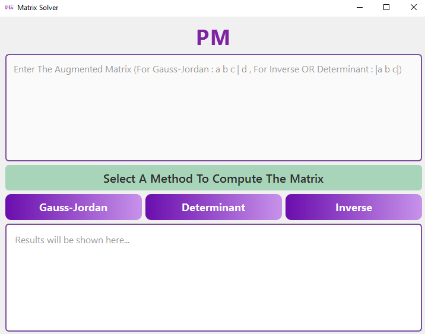
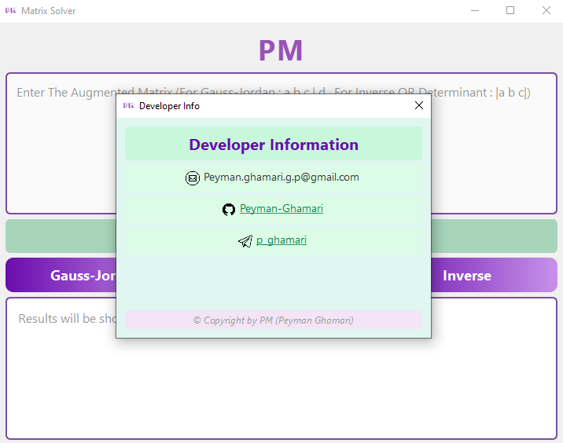

<br>
__________________________________________________________________________________________________

<br>
# Matrix Solver (Qt GUI)

This is a graphical application developed in **C++ with Qt framework** to perform essential matrix operations such as:

- **Gauss-Jordan Elimination**
- **Determinant Calculation**
- **Matrix Inversion**

## 🧮 Features

- Solve linear systems using the Gauss-Jordan method
- Compute determinant using row reduction
- Find inverse of a matrix using augmented matrix
- Clear and user-friendly interface built with **Qt Widgets**
- Visual matrix input using a text box (multi-line)
- Green-Purple modern UI theme
- Developer information accessible via clickable label
- Windows release executable with custom icon
- ✔️ Easy-to-use setup installer included for convenience

## 📷 Screenshots

  


## 🛠️ Technologies Used

- C++17
- Qt 6.8.1
- CLion IDE
- CMake
- MinGW (Windows build)

## ✅ How to Use

### Gauss-Jordan

- Input the augmented matrix by typing each row in this format:
  ```
  a b c | d
  e f g | h
  ```
- Or:
  ```
  a b c d
  e f g h
  ```
- Use **space** or **pipe (|)** as separators. Each line represents a new matrix row.
- Press **Solve** to get the result. Works for systems with:
  - Unique solution
  - No solution (inconsistent)
  - Infinite solutions

### Determinant

- Enter a **square matrix** (e.g., 3×3 or 4×4).
- Use the same input format.
- Hit **Calculate Determinant**.

### Inverse

- Enter a **square matrix**.
- Press **Find Inverse**.
- The inverse will be shown if the matrix is non-singular.

## 💿 Easy Installation

To make installation as easy as possible for all users, an installer is provided:

📁 Navigate to the `Setup` folder and run:  
**`Matrix Solver Installer.exe`**

This will install the program and all required Qt dependencies automatically, so you can enjoy the software without any technical setup.

## 📦 Build Instructions (For Developers)

### Windows (CLion + MinGW + Qt)

1. Open the project in CLion.
2. Make sure `CMakeLists.txt` has the correct path to Qt 6.8.1 (e.g., `C:/Qt/6.8.1/mingw_64`).
3. Build in **Release** mode.
4. Output executable will be in:  
   ```
   cmake-build-release/
   ```

### Linux (Ubuntu)

```bash
sudo apt install qt6-base-dev build-essential cmake
git clone https://github.com/Peyman-Ghamari/Matrix-Solver-Qt.git
cd Matrix-Solver-Qt
mkdir build && cd build
cmake ..
make
./MatrixSolver
```

---

© 2025 Peyman Ghamari  
Feel free to contribute or fork the project!
